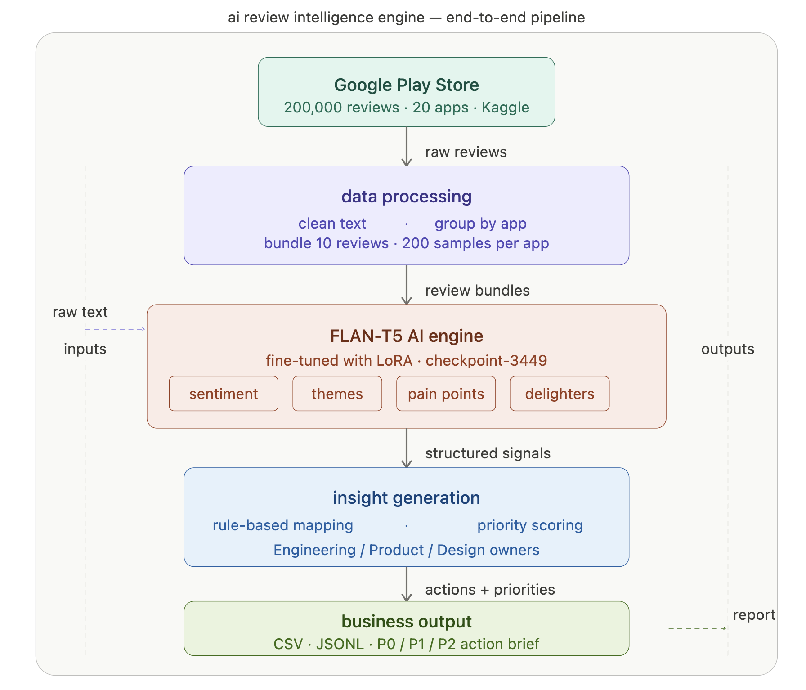
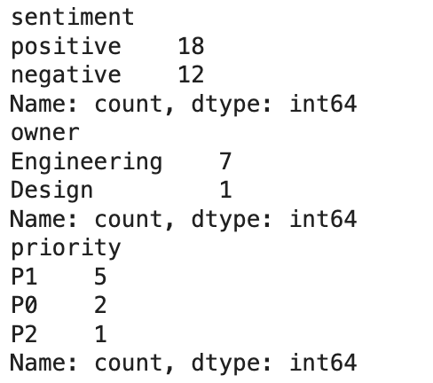

# AI Review Intelligence Engine (Voice of Customer)

This project is an AI-powered system that analyzes real-world Google Play app reviews and generates structured insights such as sentiment, themes, pain points, delighters, and recommended actions.

# Architecture

## 🔹 Features
- Sentiment Analysis (Positive / Negative / Mixed)
- Theme Extraction
- Pain Point Detection
- Delighter Identification
- Action Recommendations (Engineering / Product / Design / Support)
- Summary Generation
- Exported outputs in CSV and JSONL formats

## 🔹 Dataset
Google Play Store App Reviews (Top 20 Apps)  
Real-world user feedback with 200K+ reviews.

## 🔹 Approach
- Cleaned and processed review text
- Grouped reviews by app for contextual understanding
- Used FLAN-T5 language model to extract insights
- Applied rule-based mapping to generate business actions
- Generated structured outputs for analysis

## 🔹 Sample Insights (30 Review Bundles)
- Positive Sentiment: 18  
- Negative Sentiment: 12  
- Engineering Actions: 7  
- Design Actions: 1  
- Priority Levels: P1=5, P0=2, P2=1  

## 🔹 Output Files
- `review_intel_outputs.csv`
- `review_intel_outputs.jsonl`

## 🔹 Goal
To demonstrate how AI can transform unstructured customer reviews into actionable business insights, helping teams identify and resolve issues faster than manual review methods.
